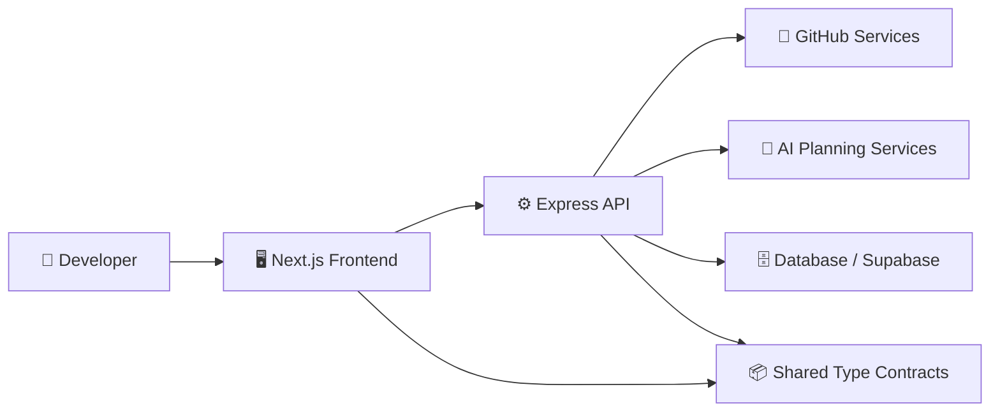

# 🧭 OpenForge


**OpenForge** is an AI-powered workspace for understanding repositories and contributing to open source.

The project studies a practical research question:

> How can GitHub profile intelligence, repository metadata, and AI-guided planning reduce the discovery and onboarding friction faced by new and intermediate open-source contributors?

---

## 📌 Abstract

Open-source participation is often limited by information overload, unclear contribution pathways, and the difficulty of matching a developer's abilities to suitable repositories. OpenForge proposes a structured recommendation and planning system that combines GitHub data, skill analysis, repository assessment, and AI-generated contribution guidance.

The current implementation provides a full-stack TypeScript foundation with a Next.js frontend, Express backend, shared contracts package, Supabase-ready authentication utilities, GitHub-oriented service layers, dashboard views, AI planning panels, and database artifacts. The repository is organized as a monorepo to keep application, API, and shared type contracts aligned during iterative research and product development.

## 🔑 Keywords

`Open Source Discovery` · `GitHub Intelligence` · `AI Contribution Planning` · `Developer Onboarding` · `Repository Recommendation` · `Full-Stack TypeScript`

## 🎯 Research Objectives

| Objective | Description |
| --- | --- |
| 🧠 Skill-aware matching | Analyze contributor context and align users with repositories that fit their current technical profile. |
| 🔎 Repository understanding | Surface repository details, contribution opportunities, issues, and project signals in a structured dashboard. |
| 🛠️ Contribution planning | Generate actionable contribution plans, learning roadmaps, and repository-specific guidance. |
| 🔐 Authenticated workflow | Support protected application flows with Supabase-ready authentication and onboarding. |
| 📊 Evaluation readiness | Maintain modular services and shared contracts so recommendation quality can be evaluated over time. |

## 🧩 System Overview



## 🏗️ Architecture

| Layer | Technology | Responsibility |
| --- | --- | --- |
| 🖥️ Frontend | Next.js 15, React 19, Tailwind CSS | Application shell, protected pages, dashboards, repository views, AI result panels. |
| ⚙️ Backend | Express, TypeScript, Zod | REST API, request middleware, controllers, services, validation, health endpoints. |
| 📦 Shared | TypeScript workspace package | Shared API types, constants, and contracts used by frontend and backend. |
| 🗄️ Data | SQL schema, Supabase-ready utilities | User, repository, recommendation, and contribution-oriented persistence model. |
| 🤖 AI Services | Backend service abstraction | Repository analysis, contribution planning, roadmap generation, and AI response shaping. |
| 🐙 GitHub | GitHub client/service layer | Repository metadata, issue-oriented workflows, and developer profile integration. |

## ✨ Feature Matrix

| Area | Status | Notes |
| --- | --- | --- |
| ✅ Monorepo foundation | Implemented | `frontend`, `backend`, and `shared` use isolated npm installs and lockfiles. |
| ✅ Health API | Implemented | `GET /health` and versioned health routes. |
| ✅ Dashboard shell | Implemented | Auth-aware application area with dashboard-oriented components. |
| ✅ GitHub service layer | Implemented | Backend client/service structure and frontend API adapters. |
| ✅ AI planning UI | Implemented | Panels for repository AI, learning roadmap, and contribution planning. |
| ✅ Shared contracts | Implemented | Reusable TypeScript package for cross-layer consistency. |
| 🚧 Automated tests | Planned | Workspace test scripts currently act as placeholders. |
| 🚧 Production deployment | Planned | Docker and deployment script placeholders are present. |

## 📁 Repository Structure

```text
OpenForge/
├── frontend/                         # Next.js application workspace
│   ├── app/                           # App Router pages and layouts
│   │   ├── app/                       # Protected application routes
│   │   ├── auth/callback/             # Authentication callback route
│   │   ├── login/                     # Login page
│   │   └── onboarding/                # User onboarding page
│   ├── components/                    # UI, auth, dashboard, GitHub, and AI components
│   ├── lib/                           # API clients, environment helpers, Supabase client
│   └── package.json                   # Frontend scripts and dependencies
├── backend/                           # Express API workspace
│   ├── src/
│   │   ├── config/                    # Environment configuration
│   │   ├── controllers/               # Route controllers
│   │   ├── lib/                       # HTTP errors, JWT, GitHub and Supabase helpers
│   │   ├── middleware/                # Auth, errors, request IDs, 404 handling
│   │   ├── repositories/              # Data access abstractions
│   │   ├── routes/                    # API route modules
│   │   ├── services/                  # GitHub, AI, dashboard, settings, notification logic
│   │   └── server.ts                  # API entry point
│   └── package.json                   # Backend scripts and dependencies
├── shared/                            # Shared TypeScript package
│   └── src/                           # API contracts, constants, and shared types
├── database/                          # SQL schema, migrations, and seeds
├── scripts/                           # Development, sync, and deployment script placeholders
├── docker-compose.yml                 # Optional local PostgreSQL service
├── ├── package.json                       # Root helper scripts
└── README.md                          # Research-grade project overview
```

## 🧪 Methodology

The project follows an incremental research-and-build methodology:

1. **Profile acquisition**: collect authenticated developer context through GitHub and onboarding flows.
2. **Repository signal extraction**: inspect repository metadata, issue surfaces, contribution hints, and project activity.
3. **Skill-to-repository alignment**: compare contributor skill state against repository complexity and contribution opportunities.
4. **AI-assisted planning**: produce contribution plans, learning roadmaps, and repository-specific explanations.
5. **Feedback and evaluation**: refine recommendation quality using user actions, saved repositories, and contribution outcomes.

## ⚙️ Prerequisites

| Tool | Recommended Version | Purpose |
| --- | --- | --- |
| Node.js | 20+ | Runtime for frontend, backend, and shared packages. |
| npm | 10+ | Package manager for each app folder. |
| Docker | Optional | Local PostgreSQL service through `docker-compose.yml`. |

## 🚀 Local Development

1. Install dependencies.

   ```bash
   npm run install:all
   ```

2. Create local environment files.

   ```bash
   cp .env.example .env
   cp frontend/.env.example frontend/.env.local
   cp backend/.env.example backend/.env
   ```

3. Start PostgreSQL if you want the local database service.

   ```bash
   docker compose up -d postgres
   ```

4. Run the development stack.

   ```bash
   npm run dev:backend
   npm run dev:frontend
   ```

| Service | Default URL |
| --- | --- |
| 🖥️ Frontend | `http://localhost:3000` |
| ⚙️ Backend | `http://localhost:4000` |

## 🧰 Command Reference

```bash
npm run install:all     # Install shared, backend, and frontend dependencies independently
npm run dev:frontend    # Build shared, then start only the Next.js frontend
npm run dev:backend     # Build shared, then start only the Express backend
npm run build           # Build shared, backend, and frontend packages
npm run typecheck       # Type-check all TypeScript packages
npm run test            # Run backend and frontend test placeholders
npm run build --prefix backend     # Build backend from its own folder
npm run build --prefix frontend    # Build frontend from its own folder
```

## 🔐 Environment Model

The repository includes example environment files for the root, frontend, and backend packages. Runtime configuration is centralized through environment helper modules so missing or invalid values can be reported clearly during development.

```text
.env.example
frontend/.env.example
backend/.env.example
```

## 📊 Evaluation Plan

Future evaluation can measure the platform with both engineering and user-centered criteria:

| Dimension | Example Metric |
| --- | --- |
| Recommendation quality | Match score relevance, accepted recommendations, saved repositories. |
| Onboarding efficiency | Time from login to first actionable contribution plan. |
| AI usefulness | User rating of generated roadmap, plan specificity, hallucination rate. |
| System reliability | API uptime, response latency, failed GitHub sync attempts. |
| Developer experience | Type coverage, build success, maintainability of shared contracts. |

## 🗺️ Development Roadmap

| Phase | Focus |
| --- | --- |
| Phase 1 | Full-stack foundation, shared contracts, health endpoints, initial app shell. |
| Phase 2 | Supabase GitHub OAuth, authenticated user bootstrap, onboarding, protected routes. |
| Phase 3 | GitHub synchronization, repository exploration, issue discovery, profile enrichment. |
| Phase 4 | AI recommendation engine, contribution planner, learning roadmap generation. |
| Phase 5 | Evaluation loops, analytics, notification workflows, deployment hardening. |

## 🤝 Contribution Notes

OpenForge is structured for modular contribution. Frontend work generally belongs in `frontend/app`, `frontend/components`, or `frontend/lib`; backend work should follow the route-controller-service structure under `backend/src`; shared API contracts should be placed in `shared/src` when both application layers need the same type definitions.

Before opening a pull request, run:

```bash
npm run typecheck
npm run build
```

## 📜 License

This project is licensed under the MIT License. See the [LICENSE](LICENSE) file for details.
